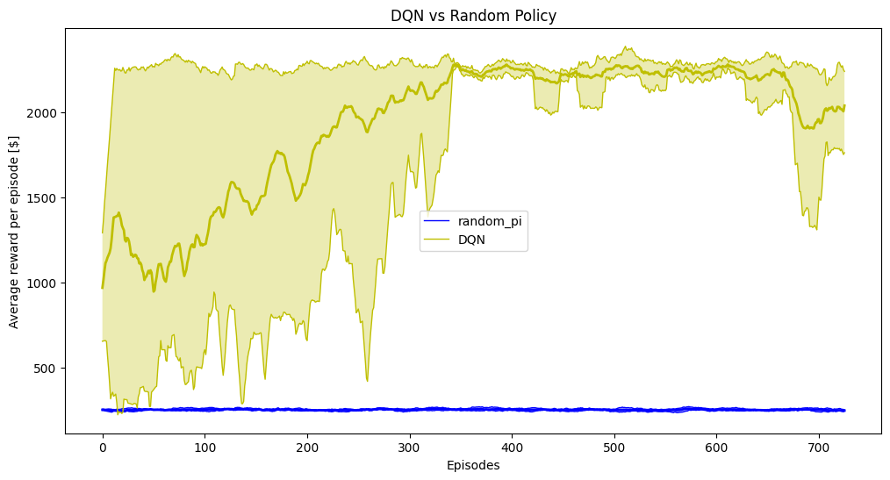
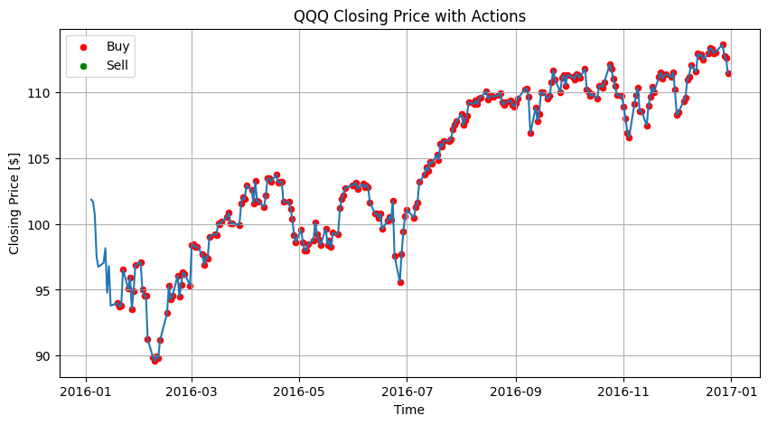

# Short-Term Investment Strategies with Deep Q-Network (DQN)

This repository contains my **Applied Reinforcement Learning** exam project: a **Deep Q-Network (DQN)** agent trained to perform **short-term trading** on historical market data.

The core idea is the creation of a **Gymnasium-inherited environment**, then train a **value-based RL agent** ***(DQN)*** to learn a policy over three discrete actions: **Buy, Hold, Sell**.

Note that this is a very **vanilla-base** implementation for learning purposes.

<p align="center">
  
  <br>
  <em> Ideal representation of a trading bot </em>
</p>

---

## Project Overview

### What this project does
- Builds a custom **Gymnasium environment** (`TradingEnv`) using prices downloaded via `yfinance`.
- Represents the environment **state** as a **sliding window of percentage price changes**.
- Trains a **DQN agent** in PyTorch using:
  - replay memory buffer
  - target network updates
  - epsilon-greedy exploration
- Produces a simple rendering plot with Matplotlib showing price history and the agent’s actions taken per step.

### Action space
- `0`: Buy (1 share if affordable)
- `1`: Hold
- `2`: Sell (1 share if held)

### Reward
The reward signal is a **monetary reward**, computed as the variation of portfolio value between consecutive steps:
- Portfolio value = `cash + shares * current_price`
- Reward = `new_portfolio_value - old_portfolio_value`

This aligns the RL objective with the trading objective: **maximize final portfolio value**.

---

### Environment assumptions / constraints
- Each action trades **at most 1 share** (Buy/Sell) per step.
- **No transaction costs / slippage** by default.
- The environment is **exogenous**: the agent’s actions do not affect future prices.
- Episodes end when the dataset ends (or earlier if the wallet value becomes non-positive).
- The state space only takes into account percentage price variations. This is a very strong limitations, as shown by the section SOTA of the notebook.

---

### Why DQN
I adopt **Deep Q-Network (DQN)** because the state space is a compact numerical vector (sliding window) of percentage price variations, hence it is represented in a continuous domain.  
To improve stability with function approximation, the implementation includes **experience replay**, a **target network**, and **epsilon-greedy exploration**.

---

## Repository Structure

- `project.ipynb`  
  Main notebook: methodology, experiments, training loop, results and plots.   
  The notebook contains all the motivations and mathematical reasonings behind crucial choices made throught the report.

- `tradingenv.py`  
  Custom Gymnasium environment implementation (`TradingEnv`).

- `requirements.txt`  
  Python dependencies.

- `trading_bot.JPG`, `sensitivity.png`, `actions_taken.png`  
  Images used in the notebook and the README.

---

## Important requirement for GPU acceleration
Since I have run the Notebook on my laptop with a Nvidia GPU, I have installed the torch version: `torch==2.5.1+cu121`, as written in the requirements.\
 Note that if you have a MPS instead, you should pip install your version accordingly.

---

## Installation

1. Clone the repository:
   ```bash
   git clone <repository-url>
2. Move into the project folder:
   ```bash
   cd <folder>
3. Install dependencies:
   ```bash
   pip install -r requirements.txt

---

## How to run
Open the notebook and execute the cells in order:
   ```bash
   jupyter notebook project.ipynb
   ```

Inside the notebook you can configure the fundamental hyperparameters of the class environment:

* ticker symbol (e.g., SPY, AAPL, QQQ, ...)
* date range
* data granularity (e.g.: hourly, daily, monthly, ...)
* sliding window length
* initial wallet (cash and shares)
* DQN hyperparameters (gamma, learning rate, batch size, epsilon schedule, ecc...)

Note that throught the Notebook you will find all others fundamental hyperparameters preceded with a `#HYP!` comment.

---

## Experimental setup & evaluation
Training and evaluation are performed using a **time-based split** (train on an earlier period, test out-of-sample on a later period).  
Performance is assessed by comparing the DQN agent against the simple baseline of a **random policy.**

The main metric used in the notebook include **final portfolio value** (and the corresponding cumulative PnL).\
Plots of actions over price are provided for qualitative inspection.

---
*Performance compared to random policy*

<p align="center"> 
    
   <br> 
   <em>Agent's performance over the episodes</em> 
</p>

*Behaviour Preview*

<p align="center"> 
    
   <br> 
   <em>Price series with the agent’s actions</em> 
</p>

---

## Results & discussion (summary)
Results are discussed in detail inside `project.ipynb`, including stability/overfitting considerations and sensitivity to the selected market period (regime).  
In general, performance can vary significantly across different market phases; therefore, **out-of-sample testing** and baseline comparisons are essential.

***As already mentioned, this vanilla-base implementation is strongly limited especially on the state representation, since academic studies provide evidence that inserting more relevant features in terms of financial metrics, can strongly improve the generalization capabilities of the RL agent.\
In our learning set up, the agent shows evidence of learning capabilities in terms of recognizing bullish/bearish patterns in training, and then acting consequently in testing (more prone to buy/sell).***

---

## Notes & Limitations

This project is an educational implementation and intentionally simplifies several real-world aspects of trading:

* No transaction costs / slippage (unless explicitly enabled in code).

* The market dynamics are exogenous: the agent’s actions do not influence future prices.

* Generalization is evaluated via out-of-sample testing (recommended), since in-sample performance can be misleading.  
Note that is fundamental to use as testing samples, time series *financially similar* to training time series.

If you want to extend the project, good next steps are:

* **Insert more financial features for state representation.**

* transaction costs and spread modeling

* more informative state features (technical indicators, volatility measures, etc.)

* walk-forward validation

* Double DQN / Dueling DQN / Prioritized Experience Replay

---

## References / Credits
* Professor Berta’s RL material and examples:   
   https://github.com/riccardoberta/reinforcement-learning

* q-trader (inspiration for trading-RL framing):   
   https://github.com/edwardhdlu/q-trader

* Gymnasium (Farama Foundation, for the creation of the environment):   
   https://gymnasium.farama.org/
